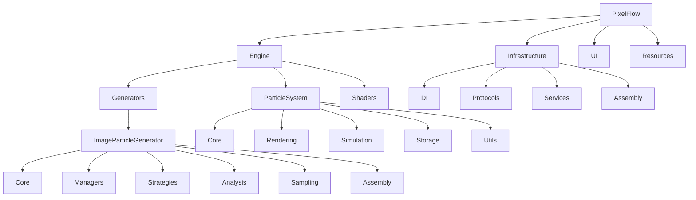

# План рефакторинга структуры папок PixelFlow

## Анализ текущей структуры

### Текущая структура соответствует README.md
- Общая архитектура: Assembly/, Engine/, UI/, Resources/, Docs/
- Engine/: Generators/, ParticleSystem/, Shaders/
- Infrastructure/ присутствует, но не отражен в README.md

### Несоответствия с планами рефакторинга

#### 1. ImageParticleGenerator
**Текущая структура:**
```
ImageParticleGenerator/
├── Core/ (старые компоненты)
├── Analysis/
├── Assembly/
├── Caching/
├── Configuration/
├── Errors/
├── Refactored/ (новые компоненты)
├── Sampling/
├── Strategies/ (дублирование с Sampling/Strategies/)
```

**Предложенная в плане:**
```
ImageParticleGenerator/
├── Core/ (GenerationCoordinator, GenerationPipeline, GenerationContext)
├── Managers/ (MemoryManager, OperationManager, CacheManager)
├── Strategies/ (GenerationStrategy, SequentialStrategy, etc.)
├── Analysis/ (существующие)
├── Sampling/ (существующие)
└── Assembly/ (существующие)
```

**Несоответствия:**
- Отсутствует папка Managers/
- Временная папка Refactored/ содержит новые компоненты
- Дублирование Strategies/
- Configuration/ и Errors/ не предусмотрены в новом плане
- Caching/ должен быть интегрирован в Managers/

#### 2. ParticleSystem
**Текущая структура:**
```
ParticleSystem/
├── Core/
├── Extension/
├── Models/
├── Particles/
├── Refactored/ (новые компоненты)
├── Rendering/
├── Simulation/
└── Utils/
```

**Предложенная в плане:**
```
ParticleSystem/
├── Core/ (ParticleSystemCoordinator, etc.)
├── Rendering/ (MetalRenderer, PipelineManager, BufferManager)
├── Simulation/ (ParticleSimulator, StateManager, PhysicsEngine)
└── Storage/ (ParticleStorage, ConfigManager)
```

**Несоответствия:**
- Отсутствует папка Storage/
- Extension/, Models/, Particles/ не соответствуют предложенным категориям
- Refactored/ содержит новые компоненты вместо интегрированных

## Предлагаемые изменения

### 1. Рефакторинг ImageParticleGenerator

#### Переименование и перемещение папок:
1. **Создать Managers/** - переместить:
   - `CacheManager.swift` из Caching/
   - `MemoryManager.swift` из ParticleSystem/Refactored/ (или создать новый)
   - `OperationManager.swift` из Refactored/

2. **Обновить Core/**:
   - Переместить `GenerationCoordinator.swift`, `GenerationPipeline.swift`, `GenerationContext.swift` из Refactored/ в Core/
   - Интегрировать или заменить существующие файлы в Core/

3. **Консолидировать Strategies/**:
   - Оставить один Strategies/ на уровне ImageParticleGenerator/
   - Переместить стратегии из Sampling/Strategies/ и Sampling/Strategies/Advanced/
   - Переименовать в соответствии с планом (SequentialStrategy, ParallelStrategy, etc.)

4. **Обработать оставшиеся папки:**
   - Configuration/ → интегрировать в Core/ или Managers/
   - Errors/ → оставить отдельно или интегрировать в Core/
   - Удалить Refactored/ после миграции

### 2. Рефакторинг ParticleSystem

#### Переименование и перемещение папок:
1. **Создать Storage/** - переместить:
   - `ParticleStorage.swift` из Refactored/
   - `ConfigurationManager.swift` из Refactored/ (как ConfigManager)
   - Возможно, модели из Models/ и структуры из Particles/

2. **Обновить Core/**:
   - Переместить `ParticleSystemCoordinator.swift` из Refactored/
   - Добавить протоколы и фабрику по плану

3. **Обновить Rendering/**:
   - Переместить `MetalRenderer.swift` из Refactored/
   - Возможно, добавить PipelineManager и BufferManager

4. **Обновить Simulation/**:
   - Переместить `SimulationEngine.swift` из Refactored/
   - Переименовать существующие компоненты по плану

5. **Обработать оставшиеся папки:**
   - Extension/ → интегрировать в Core/ или Utils/
   - Models/, Particles/ → частично в Storage/, частично в Core/
   - Utils/ → оставить
   - Удалить Refactored/ после миграции

### 3. Общая структура проекта

#### Возможные улучшения:
1. **Assembly/** → переместить в Infrastructure/ как Infrastructure/Assembly/
   - ParticleAssembly.swift подходит для Infrastructure/
   - ParticleViewModel.swift → возможно в UI/
   - ViewController.swift → в UI/

2. **Infrastructure/** - добавить в README.md:
   - DI/, Protocols/, Services/, Assembly/

## План миграции

### Фаза 1: Подготовка (1 неделя)
1. Создать новые папки (Managers/, Storage/)
2. Скопировать файлы в новые локации
3. Обновить import statements
4. Проверить компиляцию

### Фаза 2: Интеграция (1 неделя)
1. Удалить старые файлы и папки (Refactored/, дублирующие Strategies/)
2. Обновить все ссылки на перемещенные файлы
3. Интегрировать конфигурацию и ошибки
4. Тестирование

### Фаза 3: Финализация (3 дня)
1. Обновить документацию (README.md, plans/)
2. Провести интеграционное тестирование
3. Code review

## Риски и mitigation

### Технические риски

#### 1. Сломанные импорты и ссылки
**Описание:** Перемещение файлов может привести к разрыву import statements в Swift файлах и других зависимостях.
**Вероятность:** Высокая
**Влияние:** Проект не компилируется, ошибки в runtime

**Mitigation:**
- Использовать IDE refactoring tools для автоматического обновления импортов
- Создать скрипт для поиска и замены путей импортов
- Тестировать компиляцию после каждого перемещения
- Использовать git для отслеживания изменений и быстрого отката

#### 2. Регрессии в функциональности
**Описание:** Изменения в структуре могут случайно сломать существующую логику.
**Вероятность:** Средняя
**Влияние:** Неправильное поведение приложения, падения

**Mitigation:**
- Запуск полного набора unit и integration тестов после каждого шага
- Ручное тестирование ключевых сценариев использования
- Постепенная миграция с сохранением старого кода до полной проверки
- Code review для проверки изменений

#### 3. Потеря или повреждение файлов
**Описание:** Ошибки при перемещении файлов могут привести к их потере или повреждению.
**Вероятность:** Низкая
**Влияние:** Потеря кода, необходимость восстановления из git history

**Mitigation:**
- Создание backup ветки перед началом работ
- Использование git mv для перемещения файлов
- Проверка целостности файлов после перемещения
- Работа в отдельных коммитах для возможности granular отката

#### 4. Конфликты при мерже
**Описание:** Параллельная разработка может привести к конфликтам при мерже изменений структуры.
**Вероятность:** Средняя
**Влияние:** Задержки в интеграции, необходимость разрешения конфликтов

**Mitigation:**
- Коммуникация с командой о предстоящих изменениях
- Работа в отдельной feature ветке
- Регулярные мерджи с main веткой
- Документация изменений для помощи в разрешении конфликтов

#### 5. Проблемы с CI/CD
**Описание:** Изменения структуры могут сломать build scripts или deployment процессы.
**Вероятность:** Средняя
**Влияние:** Падения CI, задержки в релизе

**Mitigation:**
- Тестирование изменений в локальном CI окружении
- Обновление build scripts при необходимости
- Мониторинг CI после мерджа
- Подготовка rollback плана

### Организационные риски

#### 6. Временные задержки
**Описание:** Рефакторинг структуры требует времени и может задержать разработку новых фич.
**Вероятность:** Высокая
**Влияние:** Отставание от roadmap

**Mitigation:**
- Планирование работ в низко-нагруженные периоды
- Разделение на маленькие итерации
- Параллельная работа над разными компонентами
- Приоритизация критических изменений

#### 7. Снижение мотивации команды
**Описание:** Рефакторинг может восприниматься как "технический долг" без видимой пользы.
**Вероятность:** Низкая
**Влияние:** Снижение продуктивности

**Mitigation:**
- Четкое объяснение целей и преимуществ рефакторинга
- Демонстрация улучшений после завершения
- Вовлечение команды в планирование
- Празднование успешных этапов

### План отката

1. **Immediate rollback:** Использование git reset для отката к предыдущему коммиту
2. **Partial rollback:** Поэтапный откат изменений с сохранением полезных частей
3. **Full restoration:** Восстановление из backup ветки при необходимости
4. **Communication:** Информирование команды о проблемах и плане восстановления

### Мониторинг успеха

- **Метрики компиляции:** Время сборки, количество ошибок
- **Метрики тестирования:** Процент пройденных тестов, покрытие
- **Метрики производительности:** FPS, время генерации частиц
- **Метрики команды:** Время на разрешение конфликтов, удовлетворенность

## Mermaid диаграмма новой структуры



## Критерии успеха

- Структура соответствует планам рефакторинга
- Все импорты обновлены
- Проект компилируется без ошибок
- Тесты проходят
- Документация обновлена