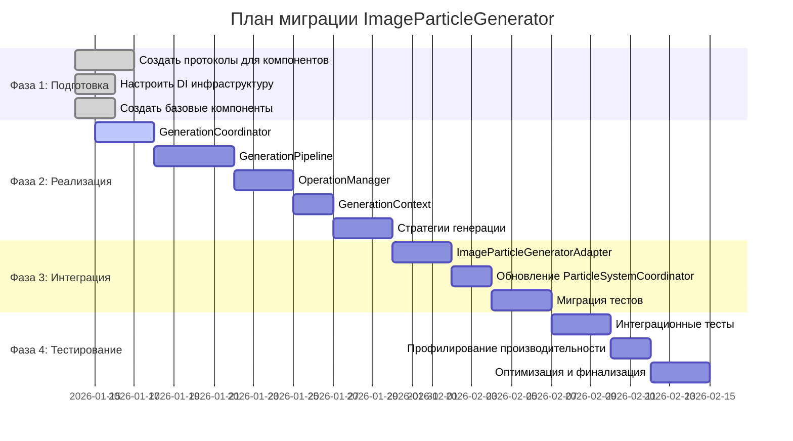

# Roadmap миграции ImageParticleGenerator

## Общий план миграции

## Детальный roadmap по компонентам

### 1. GenerationCoordinator (3 дня)
**Цель:** Главный координатор генерации частиц

**Задачи:**
- ✅ Создать протокол GenerationCoordinatorProtocol
- ⏳ Реализовать GenerationCoordinator класс
- ⏳ Интегрировать с DI контейнером
- ⏳ Добавить обработку ошибок и отмены
- ⏳ Написать unit-тесты

**Файлы:**
- `PixelFlow/Engine/Generators/ImageParticleGenerator/Refactored/GenerationCoordinator.swift`
- `PixelFlowTests/GenerationCoordinatorTests.swift`

### 2. GenerationPipeline (4 дня)
**Цель:** Конвейер выполнения этапов генерации

**Задачи:**
- ⏳ Создать протокол GenerationPipelineProtocol
- ⏳ Реализовать GenerationPipeline класс
- ⏳ Добавить поддержку стратегий выполнения
- ⏳ Интегрировать существующие компоненты (Analyzer, Sampler, Assembler)
- ⏳ Добавить обработку прогресса
- ⏳ Написать unit-тесты

**Файлы:**
- `PixelFlow/Engine/Generators/ImageParticleGenerator/Refactored/GenerationPipeline.swift`
- `PixelFlow/Engine/Generators/ImageParticleGenerator/Refactored/GenerationStage.swift`
- `PixelFlowTests/GenerationPipelineTests.swift`

### 3. OperationManager (3 дня)
**Цель:** Управление асинхронными операциями

**Задачи:**
- ⏳ Создать протокол OperationManagerProtocol
- ⏳ Реализовать OperationManager класс
- ⏳ Добавить поддержку отмены операций
- ⏳ Интегрировать с OperationQueue
- ⏳ Добавить метрики производительности
- ⏳ Написать unit-тесты

**Файлы:**
- `PixelFlow/Engine/Generators/ImageParticleGenerator/Refactored/OperationManager.swift`
- `PixelFlowTests/OperationManagerTests.swift`

### 4. GenerationContext (2 дня)
**Цель:** Хранение состояния генерации

**Задачи:**
- ⏳ Создать протокол GenerationContextProtocol
- ⏳ Реализовать GenerationContext класс
- ⏳ Добавить потокобезопасность
- ⏳ Интегрировать с MemoryManager
- ⏳ Написать unit-тесты

**Файлы:**
- `PixelFlow/Engine/Generators/ImageParticleGenerator/Refactored/GenerationContext.swift`
- `PixelFlowTests/GenerationContextTests.swift`

### 5. Стратегии генерации (3 дня)
**Цель:** Разные подходы к выполнению генерации

**Задачи:**
- ⏳ Создать базовый протокол GenerationStrategyProtocol
- ⏳ Реализовать SequentialStrategy
- ⏳ Реализовать ParallelStrategy
- ⏳ Реализовать AdaptiveStrategy
- ⏳ Добавить логику выбора стратегии
- ⏳ Написать unit-тесты

**Файлы:**
- `PixelFlow/Engine/Generators/ImageParticleGenerator/Strategies/GenerationStrategy.swift`
- `PixelFlow/Engine/Generators/ImageParticleGenerator/Strategies/SequentialStrategy.swift`
- `PixelFlow/Engine/Generators/ImageParticleGenerator/Strategies/ParallelStrategy.swift`
- `PixelFlow/Engine/Generators/ImageParticleGenerator/Strategies/AdaptiveStrategy.swift`
- `PixelFlowTests/GenerationStrategyTests.swift`

## Фазы интеграции

### Фаза 3: Интеграция (5 дней)

#### ImageParticleGeneratorAdapter (3 дня)
- Создать адаптер для совместимости
- Интегрировать новый GenerationCoordinator
- Обеспечить fallback на старую реализацию
- Протестировать совместимость API

#### Обновление ParticleSystemCoordinator (2 дня)
- Заменить прямые вызовы ImageParticleGenerator
- Интегрировать с новым протоколом
- Обновить обработку ошибок
- Протестировать интеграцию

### Фаза 4: Тестирование (8 дней)

#### Интеграционные тесты (3 дня)
- Тесты полного цикла генерации
- Тесты с разными конфигурациями
- Тесты отмены операций
- Тесты обработки ошибок

#### Профилирование производительности (2 дня)
- Сравнение с текущей реализацией
- Анализ потребления памяти
- Измерение времени выполнения
- Оптимизация bottleneck'ов

#### Финализация (3 дня)
- Code review и рефакторинг
- Обновление документации
- Подготовка к релизу
- Миграция production кода

## Критерии готовности

### Функциональная готовность
- ✅ Все публичные API работают
- ✅ Совместимость с существующим кодом
- ✅ Обработка всех edge cases
- ✅ Валидация входных данных

### Качественная готовность
- ✅ Покрытие тестами > 95%
- ✅ Производительность не хуже текущей
- ✅ Потокобезопасность
- ✅ Обработка ошибок

### Архитектурная готовность
- ✅ SOLID принципы соблюдены
- ✅ Компоненты слабо связаны
- ✅ Высокая тестируемость
- ✅ Легкость сопровождения

## Риски и меры mitigation

### Технические риски
- **Снижение производительности**: Решение - профилирование на каждом этапе, оптимизация критических путей
- **Регрессии в функциональности**: Решение - comprehensive тестирование, постепенная миграция
- **Проблемы с памятью**: Решение - интеграция с MemoryManager, мониторинг использования

### Организационные риски
- **Сложность координации**: Решение - четкий план, регулярные статус-митинги
- **Отсутствие экспертизы**: Решение - парное программирование, code review
- **Изменение требований**: Решение - гибкая архитектура, инкрементальная разработка

## Метрики успеха

| Метрика | Текущее значение | Целевое значение | Единица измерения |
|---------|------------------|------------------|-------------------|
| Размер основного класса | 569 | < 100 | строк кода |
| Покрытие тестами | ~30% | > 95% | процент |
| Время генерации (draft) | ~50ms | < 60ms | миллисекунды |
| Время генерации (ultra) | ~200ms | < 220ms | миллисекунды |
| Потребление памяти | ~100MB | < 120MB | мегабайты |
| Количество компонентов | 1 | 8 | штук |
| Цикломатическая сложность | > 20 | < 5 | на компонент |

## Следующие шаги после завершения

1. **Мониторинг production** - отслеживание метрик производительности
2. **Сбор обратной связи** - анализ использования новых API
3. **План улучшений** - на основе полученного опыта
4. **Документация** - обновление README и guides
5. **Обучение команды** - sharing knowledge о новой архитектуре